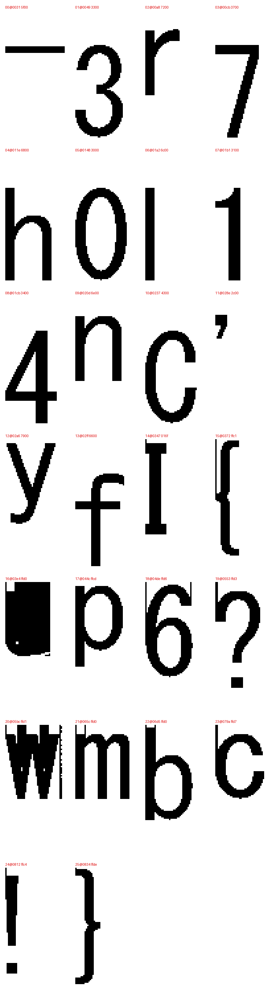

[International Cybersecurity Challenge (ICC) 2025](https://icc.ecsc.eu/past-editions/2025) was held in Chiba, Japan, at [Hotel New Otani Makuhari](https://icctokyo2025.nisc.go.jp/en/about), November 11-14, 2025. This write-up is based on my simulation and replication of a forensics challenge from that event.

---

## PJL Header

The file opens with `\x1b%-12345X@PJL`, the standard *Printer Job Language* prefix. PJL is a vendor-neutral wrapper most printer manufacturers use to encapsulate their proprietary PDLs. Everything before `@PJL ENTER LANGUAGE` is readable ASCII, making it a reliable source of forensic metadata even when the rest of the file is opaque binary.

```
@PJL JOB NAME = "flag.txt - \x83\x81\x83\x82\x92\xa0"
@PJL SET DATE = "2025/07/14"
@PJL SET TIME = "21:21:34"
@PJL SET DRIVERKINDINFO = RPCS
@PJL SET HOSTPRINTERNAME = "RICOH IM C2510 JPN RPCS"
@PJL SET HOSTNAME = "TSUJI"
@PJL SET HOSTLOGINNAME = "tsato"
@PJL SET HOSTPORTNAME = "IP_10.25.120.197"
@PJL SET PAPER = A4
@PJL SET RESOLUTION = 600
@PJL SET ROTATE = RIGHT
```

The job name suffix `\x83\x81\x83\x82\x92\xa0` is Shift-JIS encoded, it decodes to `メモ帳`, the Japanese name for Notepad. The host printed from a machine named `TSUJI` over the network (`IP_10.25.120.197`).

Two fields drive the solve path: `DRIVERKINDINFO = RPCS` identifies the PDL, and `HOSTPRINTERNAME` combined with the version string in the first RPCS block (`RPCS driver product version 1.3.0.0`) pins down the exact driver on Ricoh's public support site. `ROTATE = RIGHT` will matter when interpreting glyph coordinates later.

---

## Driver Analysis

The driver package ships with Cabinet-compressed DLLs. Expand the relevant one:

```bash
7z x driver/disk1/rici7Zgp.dl_ -o_expanded
```

Strings in `_expanded/rici7Zgp.dll`:

```
PrnPutCharBitmap
OutputCachedBitmap
mmrenc.cpp
scanlinev2.cpp
bitmap_comp_ex
```

`mmrenc.cpp` is the key. **MMR**, *Modified Modified READ*, is another name for **CCITT Group 4** (ITU-T T.6), the compression standard used in Group 4 fax machines. Its presence here means RPCS renders each character into a 1-bit glyph bitmap and compresses it with G4 before writing it to the print stream. This is why no readable strings appear in a hex editor: the text has been turned into pixels and then compressed.

---

## Data Parsing

A PJL file wraps one or more PDL payloads, each introduced by `@PJL ENTER LANGUAGE = <name>`. Ricoh RPCS files use two blocks: the first carries initialization data and glyph cache definitions; the second holds the actual page content. We want the last one.

```python
eoj   = job.find(b"\x1b%-12345X@PJL EOJ")
enter = job.rfind(b"@PJL ENTER LANGUAGE = RPCS", 0, eoj)
start = job.find(b"\n", enter) + 1
payload = job[start:eoj]
```

| Item | Value |
|------|-------|
| File size | 4837 bytes |
| First RPCS block | `0x8f7` |
| Second (final) RPCS block | `0xa22` |
| Final RPCS payload start | `0xa3d` |
| EOJ marker | `0x12a8` |
| Payload length | 2155 bytes |

---

## Glyph Chunk Format

Each character in the RPCS payload is stored as a self-contained binary chunk with a 10-byte header followed by compressed bitmap data:

```
lead[2]               , 2-byte identifier / metadata
width_be16            , glyph width in pixels (big-endian u16)
height_be16           , glyph height in pixels (big-endian u16)
compressed_length_be32, length of the G4 strip (big-endian u32)
compressed_data       , raw CCITT Group 4 compressed strip
```

Since RPCS has no public specification, chunk detection is heuristic. The scanner walks the payload byte by byte, treats each position as a candidate chunk header, validates that width/height/size values are plausible for a character glyph, then attempts an actual G4 decode. If it succeeds the chunk is accepted and the cursor advances past it; otherwise the cursor shifts by one byte and tries again.

```python
def find_g4_chunks(payload: bytes):
    chunks = []
    offset = 0
    while offset < len(payload) - 10:
        width  = int.from_bytes(payload[offset + 2:offset + 4], "big")
        height = int.from_bytes(payload[offset + 4:offset + 6], "big")
        size   = int.from_bytes(payload[offset + 6:offset + 10], "big")
        if (1 <= width <= 256 and 1 <= height <= 128
                and 1 <= size <= 512
                and offset + 10 + size <= len(payload)):
            strip = payload[offset + 10 : offset + 10 + size]
            try:
                image = Image.open(BytesIO(g4_tiff(strip, width, height)))
                image.load()
            except Exception:
                pass
            else:
                chunks.append({"offset": offset, "lead": payload[offset:offset+2],
                                "width": width, "height": height, "size": size,
                                "image": image.convert("1")})
                offset += 10 + size
                continue
        offset += 1
    return chunks
```

### CCITT Group 4 and the TIFF Wrapper

CCITT Group 4 is a lossless compression standard for 1-bit bilevel images, originally designed for Group 4 fax transmission. Unlike Group 3 which mixes 1D and 2D coding, G4 is purely 2D: each scanline is encoded as a set of run-length transitions relative to the scanline above it, exploiting the high vertical correlation typical in document images. The result is 10–30× compression on text content, which makes it well-suited for storing font glyph bitmaps.

Pillow supports G4 decoding only through the TIFF container, it won't accept a bare compressed strip. The fix is to build a minimal valid TIFF in memory. A single-strip G4 TIFF needs exactly eight IFD entries:

```python
def g4_tiff(strip: bytes, width: int, height: int) -> bytes:
    entries = [
        (256, 4, 1, width),
        (257, 4, 1, height),
        (258, 3, 1, 1),           # BitsPerSample = 1
        (259, 3, 1, 4),           # Compression = CCITT Group 4
        (262, 3, 1, 0),           # PhotometricInterpretation = 0 (white = 0)
        (273, 4, 1, 0),           # StripOffsets, patched below
        (278, 4, 1, height),      # RowsPerStrip
        (279, 4, 1, len(strip)),  # StripByteCounts
    ]
    strip_offset = 8 + 2 + len(entries) * 12 + 4
    out = bytearray(b"II*\0" + pack("<I", 8) + pack("<H", len(entries)))
    for tag, typ, count, value in entries:
        if tag == 273:
            value = strip_offset
        encoded = pack("<H", value) + b"\0\0" if typ == 3 and count == 1 else pack("<I", value)
        out += pack("<HHI", tag, typ, count) + encoded
    out += pack("<I", 0)
    out += strip
    return bytes(out)
```

Pass this to `Image.open(BytesIO(...))` and Pillow handles the G4 decode, no decoder from scratch needed.

---

## Cached vs. Inline Glyphs

RPCS uses two glyph storage strategies.

**Cached glyphs** are defined once in the first RPCS block and referenced by a short ID throughout the page. Their `lead` bytes encode the character directly: `lead[1] == 0x00` and `lead[0]` is the ASCII code. A cached `'r'` has lead `72 00`; a cached `','` has lead `2c 00`. Identification is automatic during scanning.

**Inline glyphs** arrive as fresh bitmap chunks embedded directly in the placement stream, used for characters that aren't in the cache. Their `lead` bytes carry positional delta data rather than a character code (e.g., `ff c1`, `01 6f`), so the actual character can only be determined by looking at the decoded bitmap.

The solver outputs a contact sheet of all decoded glyphs, rotated 90° to account for `ROTATE = RIGHT`, making visual identification of inline glyphs straightforward.



`flag-txt.bin` contains **26 chunks, 14 cached, 12 inline**.

### Cached Glyphs

| Offset | Lead | Char |
|--------|------|------|
| `0x0031` | `5f00` | `_` |
| `0x0049` | `3300` | `3` |
| `0x00a8` | `7200` | `r` |
| `0x00cb` | `3700` | `7` |
| `0x011e` | `6800` | `h` |
| `0x0148` | `3000` | `0` |
| `0x01a2` | `6c00` | `l` |
| `0x01b1` | `3100` | `1` |
| `0x01cb` | `3400` | `4` |
| `0x020d` | `6e00` | `n` |
| `0x0237` | `4300` | `C` |
| `0x028e` | `2c00` | `,` |
| `0x02a6` | `7900` | `y` |
| `0x02ff` | `6600` | `f` |

### Inline Glyphs (identified from contact sheet)

| Offset | Lead | Char |
|--------|------|------|
| `0x0347` | `016f` | `I` |
| `0x0372` | `ffc1` | `{` |
| `0x03e4` | `ffd0` | `u` |
| `0x044c` | `ffcd` | `p` |
| `0x04de` | `ffd6` | `g` |
| `0x0553` | `ffd3` | `?` |
| `0x05bc` | `ffd1` | `w` |
| `0x065c` | `ffd0` | `m` |
| `0x06d5` | `ffd0` | `b` |
| `0x079a` | `ffd7` | `c` |
| `0x0812` | `ffc4` | `!` |
| `0x0834` | `ffde` | `}` |

---

## Placement Commands

Three command opcodes in the RPCS payload position glyphs on the page. All coordinates are cumulative signed deltas from the previous pen position.

**`43 06`**, place a cached glyph. Applies `dx` and `dy` to the current pen position, then looks up the character by `(char_id, sub_id)` in the cached glyph table.

```
43 06 dx_be16 dy_be16 char_id sub_id
```

**`43 0c`**, place an inline glyph. Carries only `dx`; the `dy` is encoded in the `lead` bytes of the bitmap chunk that immediately follows in the stream.

```
43 0c dx_be16
<bitmap chunk>
```

**`43 02`**, first cached glyph on the page. Same structure as `43 06` but the pen position is not updated.

---

## Coordinate System and Stream Order

The page is flagged `ROTATE = RIGHT`, rotating the entire coordinate system 90°. In RPCS space, character order along a printed line runs as **descending y**, the first character of the line has the highest y value.

Reading strictly in stream order gives:

```
ICC{h3ll0,_y0ur3_7h3_pr1n73r,_r1gh7?__w4y_m0r3_r3l14bl3_7h4n_7h3_0ff1c3_0n3!}
```

Note the double underscore before `w4y`. The driver emitted a duplicate `_` glyph event at nearly the same position, a re-render artefact. Deduplication (≤3 px tolerance) removes it.

Since the printed content is a single line, all 77 glyph events fall into one x-cluster. Sorting by descending y within that cluster yields the correct left-to-right reading order:

```python
def clustered_lines(events) -> list[str]:
    # 1. Deduplicate near-identical events (re-render artefacts, ≤3 px tolerance)
    unique = []
    seen = set()
    for event in events:
        key = (event["ch"], round(event["x"] / 3), round(event["y"] / 3))
        if key not in seen:
            seen.add(key)
            unique.append(event)

    # 2. Cluster events by x proximity (60 px threshold)
    clusters = []
    for event in unique:
        for cluster in clusters:
            if abs(cluster["x"] - event["x"]) <= 60:
                cluster["events"].append(event)
                cluster["x"] = sum(e["x"] for e in cluster["events"]) / len(cluster["events"])
                break
        else:
            clusters.append({"x": float(event["x"]), "events": [event]})

    # 3. Sort clusters top→bottom (ascending x), glyphs left→right (descending y)
    lines = []
    for cluster in sorted(clusters, key=lambda c: c["x"]):
        ordered = sorted(cluster["events"], key=lambda e: (-e["y"], e["offset"]))
        lines.append("".join(e["ch"] for e in ordered))
    return lines
```

